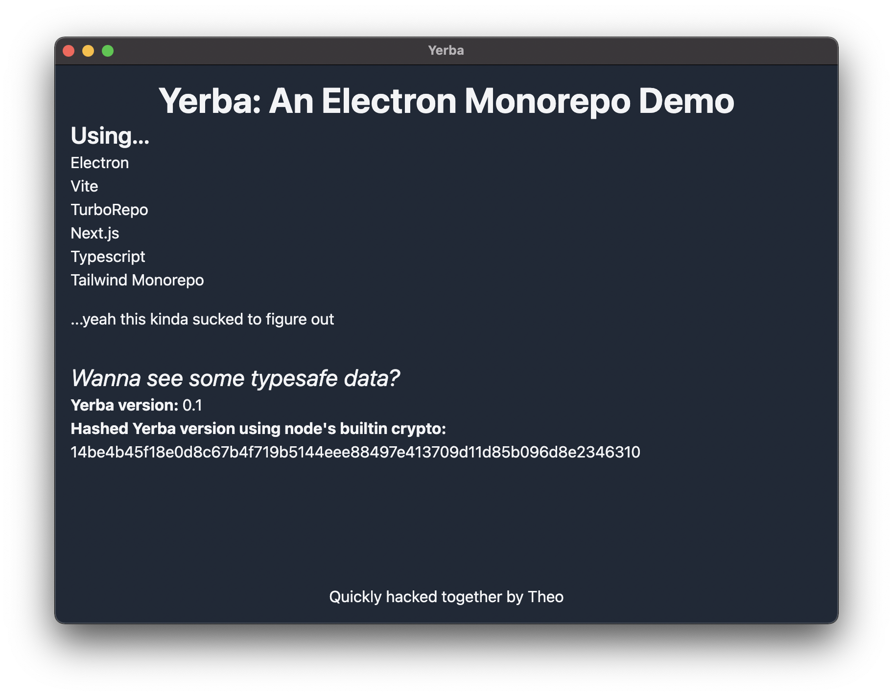

# Yerba



An Electron Monorepo Demo

Uses:

- Next.js
- Typescript
- Tailwind
- Turborepo
- Vite (for Electron builds)

## Getting Started

```bash
npm install
npm run dev
```

## Prior work

Most of this code is generously borrowed from the following

- [vite-electron-builder](https://github.com/cawa-93/vite-electron-builder)
- [Turborepo basic example](https://github.com/vercel/turborepo/tree/main/examples/basic)
